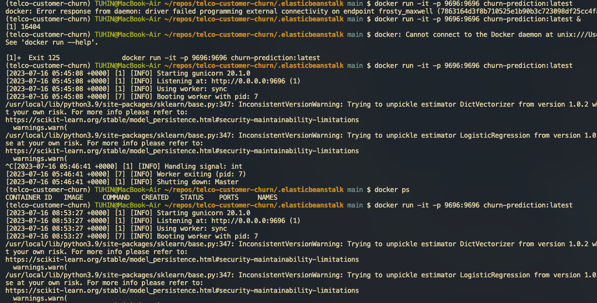

# telco-customer-churn
Predict behavior to retain customers

Data from https://www.kaggle.com/blastchar/telco-customer-churn

## Use-Case
Suppose we have a service for running marketing campaigns. For each customer, it needs to determine the probability of churn, and if it’s high enough, it will send a promotional email with discounts. Of course, this service needs to use our model to decide whether it should send an email.

## Tested the working of the app 
✅ Flask web service
✅ Docker 
✅ AWS Elastic Beanstalk

## Method
we need to create a churn service — a service in Python that will serve the
churn model. Given the features of a customer, it will respond with the probability of
churn for this customer. For each customer, the campaign service will ask the churn
service for the probability of churn, and if it’s high enough, then we send a promotional email
<picture>
 <source media="(prefers-color-scheme: dark)" srcset="imgs/churn-service.png">
 <source media="(prefers-color-scheme: light)" srcset="imgs/churn-service.png">
 
</picture>

## Steps
✅ Gets the customer data in a request

✅ Invokes predict_simple to score the customer

✅ Responds with the probability of churn in JSON

✅ Packaged the app with Docker and deployed using AWS Elastic Beanstalk

• Assigns the /predict route to the predict function

• Gets the content of the request in JSON

• Scores the customer 

• Prepares the response

• Converts the response to JSON

## Serving Flask app
<picture>
 <source media="(prefers-color-scheme: dark)" srcset="imgs/Serving-Flask.png">
 <source media="(prefers-color-scheme: light)" srcset="imgs/Serving-Flask.png">
 
</picture>

## Serving Docker app
<picture>
 <source media="(prefers-color-scheme: dark)" srcset="imgs/serving-docker.png">
 <source media="(prefers-color-scheme: light)" srcset="imgs/serving-docker.png">
 
</picture>

## Serving Elastic Beanstalk app
<picture>
 <source media="(prefers-color-scheme: dark)" srcset="imgs/serving-eb-local.png">
 <source media="(prefers-color-scheme: light)" srcset="imgs/serving-eb-local.png">
 
</picture>

## Serving AWS Elastic Beanstalk EC2 app
<picture>
 <source media="(prefers-color-scheme: dark)" srcset="imgs/serving-eb-ec2-aws.png">
 <source media="(prefers-color-scheme: light)" srcset="imgs/serving-eb-ec2-aws.png">
 
</picture>

## How to setup - install all the required libraries from Pipenv.lock
> pipenv install

### Commands
To connect to AWS EC2 instance:
> ssh -i "bookcamp.cer" ubuntu@ec2-43-204-32-195.ap-south-1.compute.amazonaws.com

Docker command to run container:
> docker run -it -p 9696:9696 churn-prediction:latest

Command to run Gunicorn: (Gunicorn "Green Unicorn" is a Python Web Server Gateway Interface HTTP server)
> pipenv run gunicorn --bind 0.0.0.0:9696 churn_serving:app

AWS Elastic Beanstalk create env, run locally and remote:
> eb init -p docker churn-serving
> eb local run --port 9696
> eb create churn-serving-env

## Issues to look out for - 
• https://github.com/awsdocs/aws-elastic-beanstalk-developer-guide/issues/149

• https://stackoverflow.com/questions/52600066/aws-elastic-beanstalk-100-0-of-the-requests-are-erroring-with-http-4xx 